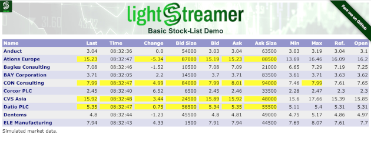
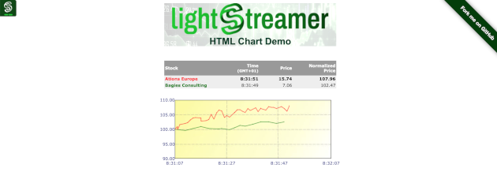

# Lightstreamer - Stock-List Demos - HTML Clients

This project includes different demos based on [Lightstreamer - Stock-List Demo - Java Adapter](https://github.com/Weswit/Lightstreamer-example-Stocklist-adapter-java):

* Basic Stock-List Demo
* Stock-List Demo
* Framed Stock-List Demo
* Simple Grid Demo
* Chart Demo

## Basic Stock-List Demo - HTML Client
<!-- START DESCRIPTION lightstreamer-example-stocklist-client-javascript-basic-stock-list-demo---html-client -->

### Live Demo

[](http://demos.lightstreamer.com/StockListDemo_Basic)<br>
###[ View live demo](http://demos.lightstreamer.com/StockListDemo_Basic)<br>

### Details

This demo displays real-time market data for ten stocks, generated by a feed simulator.<br>
This page uses the <b>JavaScript Client API for Lightstreamer</b> to handle the communications with Lightstreamer Server. A simple user interface is implemented to display the real-time data received from Lightstreamer Server. The front-end code is kept extremely simple and represents a good introduction to Lightstreamer subscription management. In particular, the client code can be considered as a reference example of item subscriptions in MERGE mode.

The demo includes the following client-side functionalities:
* A [Subscription](http://www.lightstreamer.com/docs/client_javascript_uni_api/Subscription.html) containing 10 items, subscribed to in <b>MERGE</b> mode feeding a [StaticGrid](http://www.lightstreamer.com/docs/client_javascript_uni_api/StaticGrid.html).

<!-- END DESCRIPTION lightstreamer-example-stocklist-client-javascript-basic-stock-list-demo---html-client -->

## Stock-List Demo - HTML Client
<!-- START DESCRIPTION lightstreamer-example-stocklist-client-javascript-stock-list-demo---html-client -->

### Live Demo

[](http://demos.lightstreamer.com/StockListDemo)<br>
###[ View live demo](http://demos.lightstreamer.com/StockListDemo)<br>

### Details

This demo shows some further features with respect to the [Basic Stock-List Demo](https://github.com/Weswit/Lightstreamer-example-StockList-client-javascript#basic-stock-list-demo---html-client).<br>
Click on the stock names to open pop-up windows that display real-time streaming charts. Notice that the maximum update frequency set for the pop-up windows is greater than the frequency set for the main window. The data is resampled by Lightstreamer Server, according to the maximum frequency requested by each table (you can easily notice that if you open "Ations Europe").<br>
Click on the link under the table (Next/Previous 15) to dynamically switch between two lists of fifteen items, without losing previously opened pop-ups. If you open the same demo in different browser windows, you will see slightly different values for the most updated stocks. Again, this behavior shows how the data resampling is done in real-time on a per-window basis.
Notice that a large portion of the JavaScript front-end code is devoted to client-side formatting operations.

The demo includes the following client-side functionalities:
* A [Subscription](http://www.lightstreamer.com/docs/client_javascript_uni_api/Subscription.html) containing 15 items, subscribed to in <b>MERGE</b> mode feeding a [DynaGrid](http://www.lightstreamer.com/docs/client_javascript_uni_api/DynaGrid.html).
* For each pop-up window opened, a [Subscription](http://www.lightstreamer.com/docs/client_javascript_uni_api/Subscription.html) containing 1 item, subscribed to in <b>MERGE</b> mode feeding both a [StaticGrid](http://www.lightstreamer.com/docs/client_javascript_uni_api/StaticGrid.html) and a [Chart](http://www.lightstreamer.com/docs/client_javascript_uni_api/Chart.html).

<!-- END DESCRIPTION lightstreamer-example-stocklist-client-javascript-stock-list-demo---html-client -->

## Framed Stock-List Demo - HTML Client
<!-- START DESCRIPTION lightstreamer-example-stocklist-client-javascript-framed-stock-list-demo---html-client -->

### Live Demo

[](http://demos.lightstreamer.com/StockListDemo_Frames)<br>
###[ View live demo](http://demos.lightstreamer.com/StockListDemo_Frames)<br>

### Details

The same as the [Stock-List Demo](https://github.com/Weswit/Lightstreamer-example-StockList-client-javascript#stock-list-demo---html-client), but with a different architecture for the LightstreamerClient integration.<br>
A LightstreamerClient object is always kept alive in a hidden frame. For an explanation of the different deployment strategies, please refer to the "[JavaScript Client Guide.pdf](http://www.lightstreamer.com/latest/Lightstreamer_Allegro-Presto-Vivace_5_1_Colosseo/Lightstreamer/DOCS-SDKs/sdk_client_javascript/doc/JavaScript%20Client%20Guide.pdf)" document.

The demo includes the following client-side functionalities:
* A [Subscription](http://www.lightstreamer.com/docs/client_javascript_uni_api/Subscription.html) containing 15 items, subscribed to in <b>MERGE</b> mode feeding a [DynaGrid](http://www.lightstreamer.com/docs/client_javascript_uni_api/DynaGrid.html).
* For each pop-up window opened, a [Subscription](http://www.lightstreamer.com/docs/client_javascript_uni_api/Subscription.html) containing 1 item, subscribed to in <b>MERGE</b> mode feeding both a [StaticGrid](http://www.lightstreamer.com/docs/client_javascript_uni_api/StaticGrid.html) and a [Chart](http://www.lightstreamer.com/docs/client_javascript_uni_api/Chart.html).

<!-- END DESCRIPTION lightstreamer-example-stocklist-client-javascript-framed-stock-list-demo---html-client -->

## Simple Grid Demo - HTML Client
<!-- START DESCRIPTION lightstreamer-example-stocklist-client-javascript-simple-grid-demo---html-client -->

### Live Demo

[](http://demos.lightstreamer.com/GridDemo)<br>
###[ View live demo](http://demos.lightstreamer.com/GridDemo)<br>

### Details

This demo shows how it is possible to build a "dynamic-subscription grid" by leveraging a Lightstreamer DynaGrid.<br>
The 30 items of the [Stock-List Demo](https://github.com/Weswit/Lightstreamer-example-StockList-client-javascript#stock-list-demo---html-client) are virtually contained in the grid, but only 5 at a time are displayed. The slider to the right implements a virtual scroll bar. When the table is scrolled, the invisible items are unsubscribed from and the new visible items are subscribed to. To accomplish this, each Lightstreamer Subscription contains one item only and each row on the DynaGrid is fed by a different Lightstreamer Subscription: the granularity of subscriptions and unsubscriptions is at the row level.<br>
This technique enables to handle visual grids containing thousands of items with a very low impact on both the client side and the server side.

The demo includes the following client-side functionalities:
* A [Subscription](http://www.lightstreamer.com/docs/client_javascript_uni_api/Subscription.html) for each visible row, containing 1 item, subscribed to in <b>MERGE</b> mode. All of the Subscriptions feed the same [DynaGrid](http://www.lightstreamer.com/docs/client_javascript_uni_api/DynaGrid.html).

<!-- END DESCRIPTION lightstreamer-example-stocklist-client-javascript-simple-grid-demo---html-client -->

## Chart Demo - HTML Client
<!-- START DESCRIPTION lightstreamer-example-stocklist-client-javascript-chart-demo---html-client -->

### Live Demo

[](http://demos.lightstreamer.com/ChartDemo)<br>
###[ View live demo](http://demos.lightstreamer.com/ChartDemo)<br>

### Details

This demo shows the capability of Lightstreamer to plot some simple real-time streaming charts in pure HTML and JavaScript. This feature is also demonstrated in the pop-up windows of the [Stock-List Demo](https://github.com/Weswit/Lightstreamer-example-StockList-client-javascript#stock-list-demo---html-client). For more sophisticated charts, it is possible to use third-party charting libraries.<br>
In this chart, the prices for two stocks are normalized to 100 and plotted.

The demo includes the following client-side functionalities:
* A [Subscription](http://www.lightstreamer.com/docs/client_javascript_uni_api/Subscription.html) containing 2 items, subscribed to in <b>MERGE</b> mode feeding a [StaticGrid](http://www.lightstreamer.com/docs/client_javascript_uni_api/StaticGrid.html) and a [Chart](http://www.lightstreamer.com/docs/client_javascript_uni_api/Chart.html).

<!-- END DESCRIPTION lightstreamer-example-stocklist-client-javascript-chart-demo---html-client -->

## Install

If you want to install a version of one of these demos pointing to your local Lightstreamer Server, follow these steps:

* Note that, as prerequisite, the [Lightstreamer - Stock- List Demo - Java Adapter](https://github.com/Weswit/Lightstreamer-example-Stocklist-adapter-java) has to be deployed on your local Lightstreamer Server instance. Please check out that project and follow the installation instructions provided with it.
* Launch Lightstreamer Server.
* Get the `lightstreamer.js` file from the [Lightstreamer 5 Colosseo distribution](http://www.lightstreamer.com/download) and put it in the `src/[demo_name]/js` folder of the demo (if that is the case, please create it). Alternatively, you can build a `lightstreamer.js` file from the 
  [online generator](http://www.lightstreamer.com/latest/Lightstreamer_Allegro-Presto-Vivace_5_1_Colosseo/Lightstreamer/DOCS-SDKs/sdk_client_javascript/tools/generator.html).
  In that case, be sure to include the LightstreamerClient, Subscription, DynaGrid, StaticGrid, Chart, SimpleChartListener, and StatusWidget modules and to use the "Use AMD" version.
* Get the `require.js` file form [requirejs.org](http://requirejs.org/docs/download.html) and put it in the `src/[demo_name]/js` folder of the demo.
* This applies only for Simple Grid Demo. Get the zip file from [script.aculo.us](http://script.aculo.us/downloads) and put the `prototype.js`, `scriptaculous.js`, and `slider.js` files in the `src/[demo_name]/js/scriptaculous` folder of the demo.

You can deploy these demos to use the Lightstreamer server as Web server or in any external Web Server you are running. 
If you choose the former case, please note that in the `<LS_HOME>/pages/demos/` folder, there is a copy of some of the `src/[demo_name]` directories of this project, in other cases, please create the folders `<LS_HOME>/pages/demos/[demo_name]` then copy here the contents of the `src/[demo_name]` folder of this project.<br>
The client demos configuration assumes that Lightstreamer Server, Lightstreamer Adapters, and this client are launched on the same machine. If you need to target a different Lightstreamer server, please search this line:
```js
var lsClient = new LightstreamerClient(protocolToUse+"//localhost:"+portToUse,"DEMO");
```
in `lsClient.js` or `index.html`, depending on the demo, and change it accordingly.<br>

The demos are now ready to be launched.

## Build

The html applications can be optionally built, to reduce the number and size of the files to be downloaded by the browser, using [r.js](http://requirejs.org/docs/optimization.html). A ready-made configuration file for the build process of the Chart Demo is available in the `build_r.js` folder of this project.

The build is configured to use [Google Closure compiler](https://code.google.com/p/closure-compiler/) to minify the files. To run it as-is, you need to download [rhino](https://developer.mozilla.org/en-US/docs/Rhino) `js.jar` file, `compiler.jar` from the closure compiler project and `r.js` from RequireJS. You also need a [Java Virtual Machine](https://www.java.com/en/download/) installed on your system.

Once ready, from the `build_r.js/ChartDemo` folder, run

```cmd
java -cp compiler.jar;js.jar org.mozilla.javascript.tools.shell.Main r.js -o app.build.js
```

As an alternative, it is possible to customize the build file to use [UglifyJS](https://github.com/mishoo/UglifyJS2); in this case, it can be built using [node.js](http://nodejs.org/) instead of using the JVM.

## See Also

### Lightstreamer Adapters Needed by These Demo Clients
<!-- START RELATED_ENTRIES -->

* [Lightstreamer - Stock-List Demo - Java Adapter](https://github.com/Weswit/Lightstreamer-example-Stocklist-adapter-java)
* [Lightstreamer - Reusable Metadata Adapters - Java Adapter](https://github.com/Weswit/Lightstreamer-example-ReusableMetadata-adapter-java)

<!-- END RELATED_ENTRIES -->

### Related Projects

* [Lightstreamer - Basic Stock-List Demo - jQuery (jqGrid) Client](https://github.com/Weswit/Lightstreamer-example-StockList-client-jquery)
* [Lightstreamer - Stock-List Demo - Dojo Toolkit Client](https://github.com/Weswit/Lightstreamer-example-StockList-client-dojo)
* [Lightstreamer - Stock-List Demos - Flex Clients](https://github.com/Weswit/Lightstreamer-example-StockList-client-flex)
* [Lightstreamer - Basic Stock-List Demo - Java SE (Swing) Client](https://github.com/Weswit/Lightstreamer-example-StockList-client-java)
* [Lightstreamer - Basic Stock-List Demo - .NET Client](https://github.com/Weswit/Lightstreamer-example-StockList-client-dotnet)

## Lightstreamer Compatibility Notes

* Compatible with Lightstreamer JavaScript Client library version 6.0 or newer.
